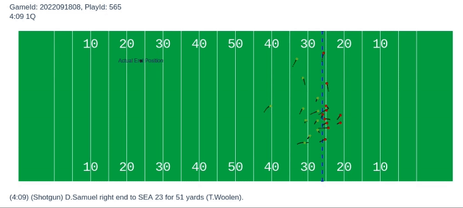

# Yards Allowed/Created Over Expected

We are currently working on getting our code published here for reproducability.

**Solution for the NFL Big Data Bowl 2024 Competition on Kaggle**

**Link:** https://www.kaggle.com/competitions/nfl-big-data-bowl-2024

**Team:** Ryan Peters and Jonathan Haak


## Introduction

### Player Objectives

A ball carrier's single objective is to move the ball forward, the defensive
objective is to prevent the ball carrier from advancing, and the objective for
the ball carrier’s teammates is to do everything possible to make the ball
carrier’s objective easier.

### Problem at Hand

These objectives are straightforward, but evaluating how effective individual
players are at accomplishing these objectives is decidedly less-so. At the team
level on Offense we can look at and compare various statistics such as Yards
per Carry, Yards after Contact, Yards after Catch, and on Defense we can
evaluate how well a team performs at limiting these statistics for opposing
offenses, but this gives us very little information on the performance of
individual players.

When a running back breaks a twenty-five yard run to the outside, how much
credit should he get? How much should the Offensive Tackle lead blocking on the
play receive? What about the receiver who effectively seals a cornerback or
safety? Conversely when a running back is tackled in the backfield, is it all
because of his ineptitude, or can we parse out where the blame is in a more
holistic and nuanced manner?

Similarly, measuring the effectiveness of individual players is more
complicated on defense than just assigning credit to the player who ends up
making the official tackle. When we see a linebacker shoot a gap and make a
great tackle, we forget that this play is often only possible because the
defensive tackle did an excellent job occupying the attention of the offensive,
not allowing an offensive lineman to reach the linebacker.

To this date, evaluating the performance of individual players on plays such as
these has been nearly impossible to do in a statistically robust manner, our
work attempts to change this.


## Our Solution

**Our strategy is simple:**
 - Create a model that predicts the position of the successful tackle of the ball carrier.
 - Create another model that predicts player movement.
 - Evaluate the difference in expected yards until tackle for predicted and actual player movement, for each player.
 - Assign this difference to each player as a performance rating.
 - Sum up performance ratings for each time window to get a rating for each player for each play.


## Reproducability


### Trajectory Model

Est Time to Reproduce: 
 - 45 minutes when training from scratch
 - 15 minutes when using provided models


First download the dataset from Kaggle (LINK) and put it under the data folder
`yards-allowed-created-over-expected/data/` that is, there should be a file
named `yards-allowed-created-over-expected/data/tracking_week_1.csv` (among the
other files). Then you can follow the rest of the commands to reproduce:

First, preprocess the data. This should take about 5 minutes depending on the
computer.

```
cd ryan
python3 preprocess.py -h && python3 preprocess.py
```

**Optional:** Train your own model on the processed dataset. This is not
required as we have provided a couple models. 

```
python3 train.py -h && python3 train.py
```

Now you can run evaluation on the model (either custom trained or provided) with 
the following command:

```
python3 visualization.py -h && python3 visualization.py
```

This should return a play that looks like the below:

<center>

</center>


